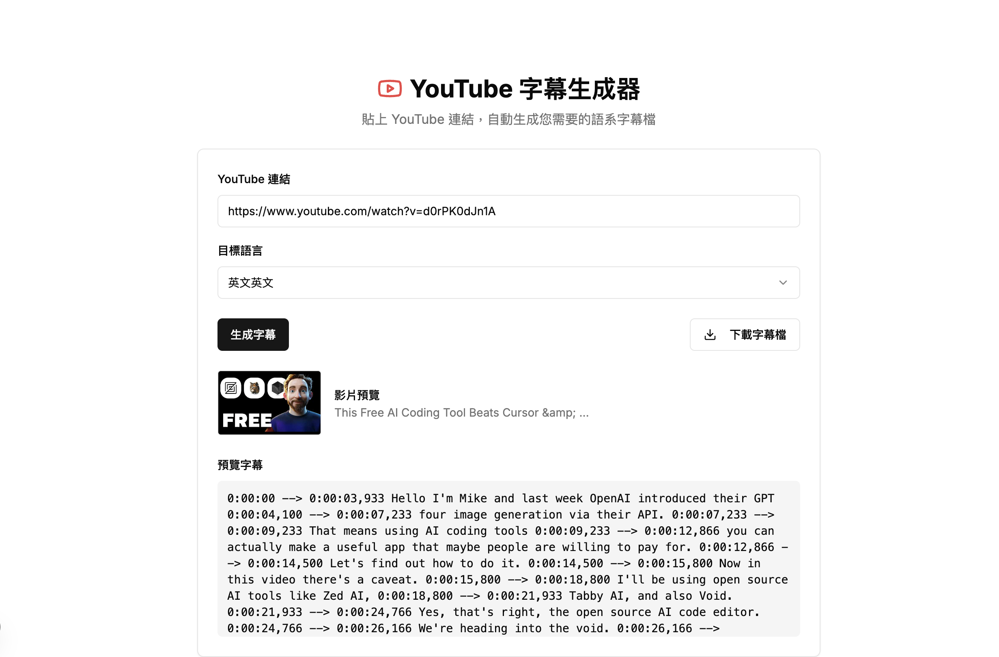

# YouTube Subtitle Generator

A modern web app for generating subtitles (SRT) from YouTube videos. Paste a YouTube link, select your target language, and automatically generate time-aligned subtitles using a combination of YouTube's transcript API and Whisper AI.

## Features
- Paste any YouTube video link and generate subtitles in multiple languages
- Uses YouTube Transcript API for fast subtitle retrieval (if available)
- Falls back to audio download + Whisper for auto-transcription if no transcript exists
- Outputs clean SRT format (timestamps only, no sequence numbers)
- Downloadable subtitle files
- Beautiful Next.js frontend with instant feedback

## Technology Stack
- **Frontend:** Next.js (TypeScript, React)
- **Backend API:** Next.js API Routes
- **Subtitle Engine:** Python (youtube-transcript-api, yt-dlp, openai-whisper)
- **Dependency Management:** [uv](https://github.com/astral-sh/uv) for Python

## Getting Started

### 1. Clone the repository
```bash
git clone <your-repo-url>
cd yt-subtitle
```

### 2. Install Node.js dependencies
```bash
npm install
```

### 3. Install Python dependencies (with `uv`)
```bash
cd subtitle_backend
uv add youtube-transcript-api yt-dlp openai-whisper
cd ..
```

### 4. Start the development server
```bash
npm run dev
```
The app will be available at [http://localhost:3000](http://localhost:3000)

## Usage
1. Open the app in your browser.
2. Paste a YouTube video URL.
3. Select your target language.
4. Click "Generate Subtitle".
5. Download or preview the generated subtitles.

## Screenshot



## Notes
- Python 3.12+ is required for backend scripts.
- If YouTube does not provide a transcript, the app will automatically download audio and use Whisper for transcription (requires more compute and time).
- All dependencies are managed with `uv` (see scripts for inline metadata).

## License
MIT
